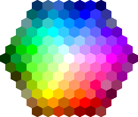

The main source code for my Java Paint are located in src/paint. 
I started the Java paint around 3rd Quarter of 2025, it was all just for fun.
But right now I will start to improved it and add more features.
This is now a fully development world of Java programming.

Update some: April 6, 2026 + some new brushes.
Knife kinda sucks, I'm too lazy to fix now wahaha
?Fixed?

This editor is I'm really proud, almost better than the paint! and that saying something >
Check: image / editor-pixel-src for the image editing program
Fully functional image editing program with effects

Editor: A text based editor with file saving

Java:

[Documentations](https://docs.oracle.com/javase/8/docs/api/)

[Language](https://docs.oracle.com/javase/8/docs/technotes/guides/language/)

